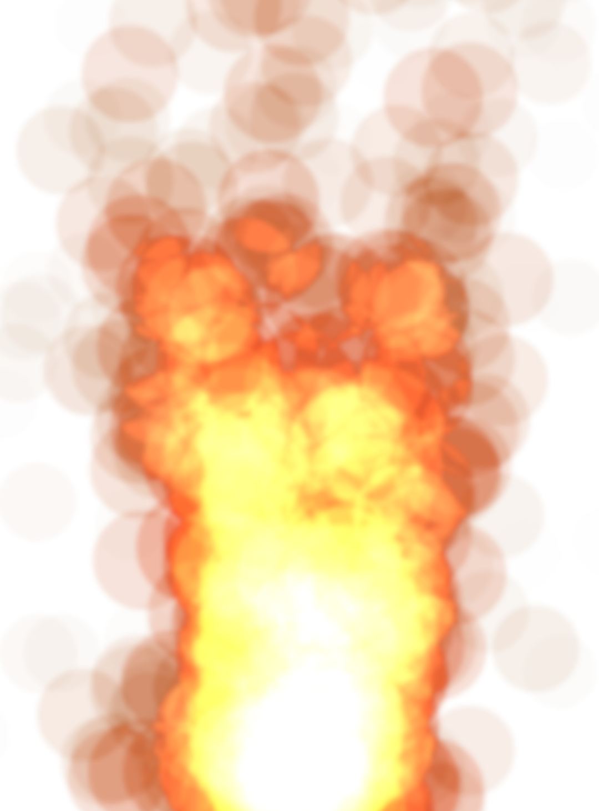

# Musical Typewriter - An Audio/Visual Experience

[Live Demo](https://dfloo.github.io)

## Overview
Musical Typewriter is a pure front-end JavaScript project that allows users to play music with visualizations using their keyboards.

Users can adjust the sound by selecting the waveform used by the synthesizer and choose from three different visualizations settings to accompany the music.


## Technology

### Web Audio API
The first step in working with Web Audio API is to create an *audio context* in which to perform the basic audio operations. Then each operation is performed with nodes that are chained together and ultimately connected to the destination. For this project I used an oscillator which takes in a frequency, and a waveform to generate the sound. 


```javascript
playSound(key) {
  const freq = getFreq(key);
  if (freq) {
    this.playFreq(freq);
  }
  this.handleAnimation(key)
}

playFreq(freq) {
  let note = new Sound(this.ctx, this.state.wave);
  let now = this.ctx.currentTime;
  if (this.state.vol === 'on') {
    note.play(freq, now);
    note.stop(now + 1);
  }
}
```

Moving forward I would like to add an adjustable volume slider, as well as some filters & effects to further customize the sound.


### HTML5 Canvas
Canvas is a very powerful 2D drawing API. Similar to working with Web Audio API, drawings in canvas must be done within a *context*. Creating animations is simply a matter of drawing something over and over again. While this could be accomplished using the JavaScript `setInterval()` function, using `requestAnimationFrame()` provides a much smoother and more efficient animation. The code snippet below illustrates how the *Rainbow* animation is drawn.

```javascript
drawRainbow() {
  const ctx = this.refs.canvas.getContext("2d");
  ctx.canvas.width = window.innerWidth * 0.7;
  ctx.canvas.height = window.innerHeight * 0.4;
  ctx.clearRect(0, 0, ctx.canvas.width, ctx.canvas.height);
  
  const mid = [
    ctx.canvas.width / 2, 
    ctx.canvas.height
  ];
  
  let radius = 0;
  let color = 0

  function draw() {
    ctx.fillStyle = 'hsl(' + color++ + ', 100%,55%)'
    ctx.beginPath();
    ctx.arc(mid[0], mid[1], radius, 0, 2 * Math.PI, false)
    ctx.fill();
    radius += 2;
    if (radius <= ctx.canvas.width * 0.68) {
      requestAnimationFrame(draw);
    } else {
      ctx.clearRect(0, 0, ctx.canvas.width, ctx.canvas.height);
    }
  }

  draw();
}
```
  


In order to create the *Fire* visualization, I utilized a particle system that renders and updates particles. With each frame, 10 new particles are added, existing particles are updated and any particles that have lived for 50 frames are removed. The particles start off as semi transparent red circles and turn grey over the course of their lives. In addition to changing color, the particles are also moved up in the y-axis and randomly in the x-axis with each frame. 


The key to making the fire look realistic is to use `globalCompositeOperation` to make overlapping particles lighter, resulting in a white hot center where the highest concentration of particles exists. 
 
